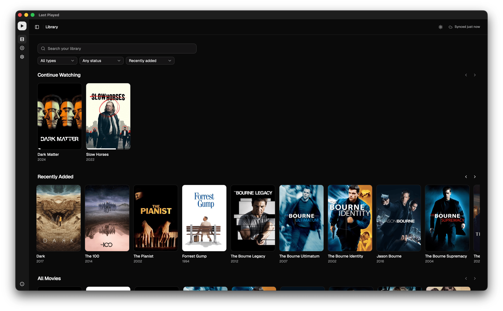
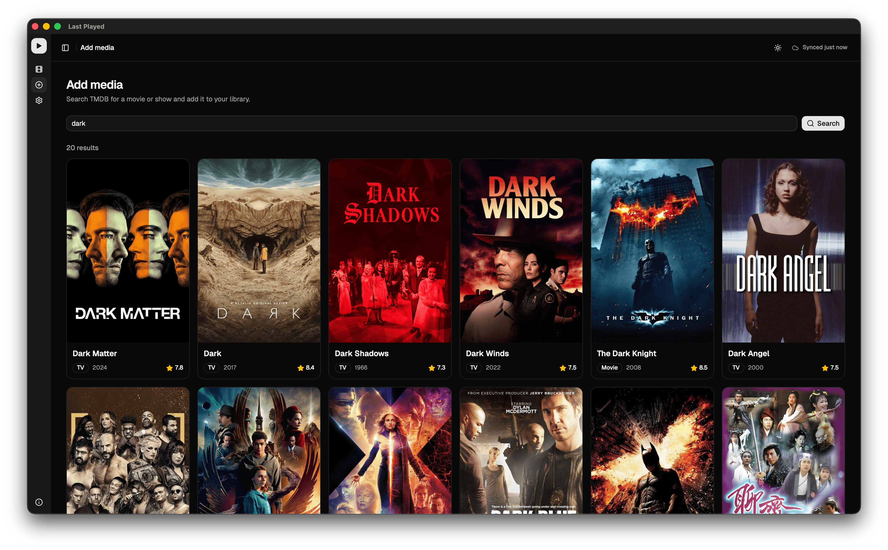
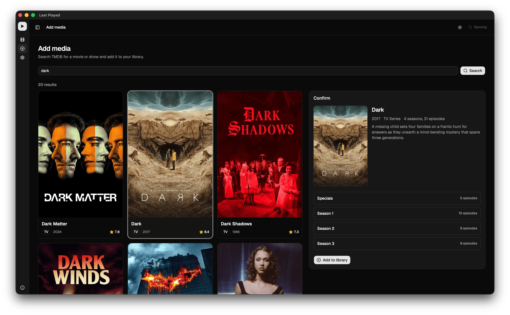
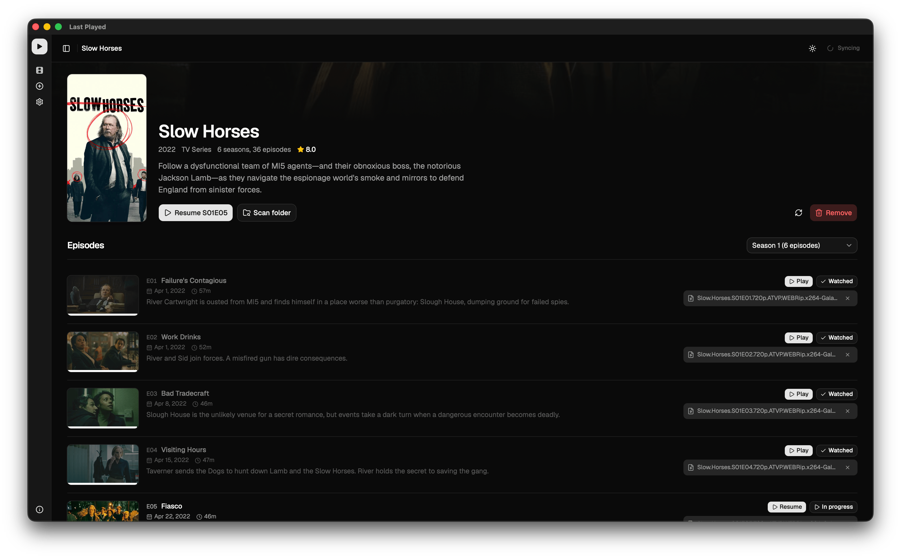
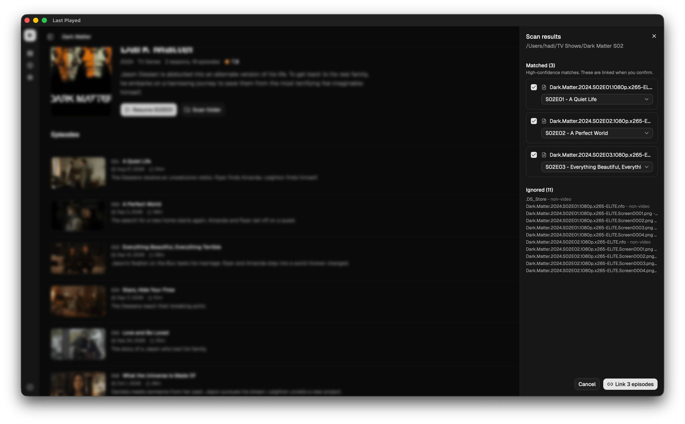
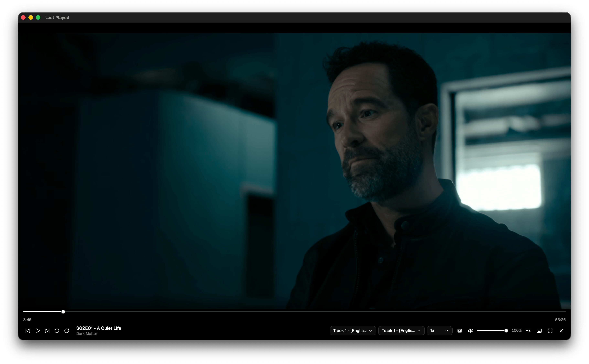
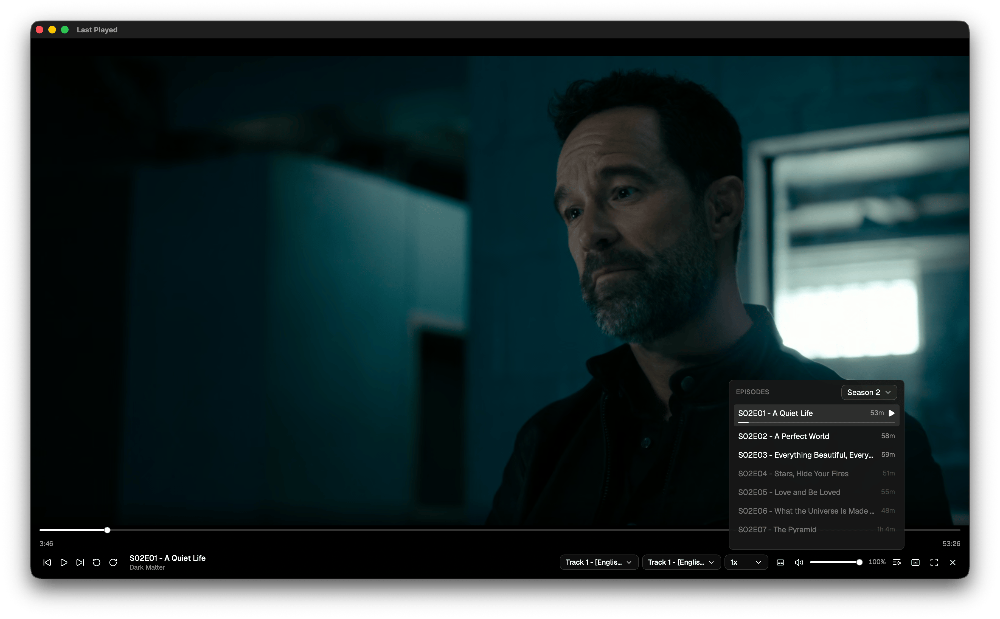
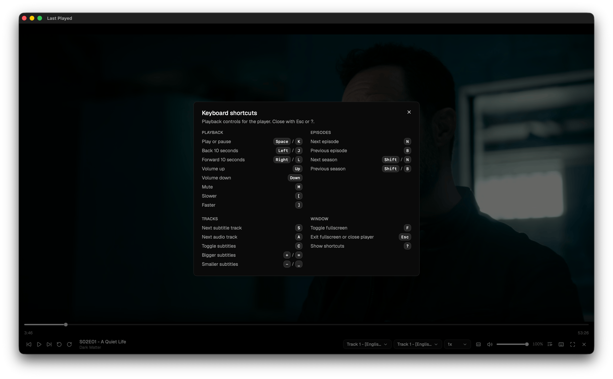
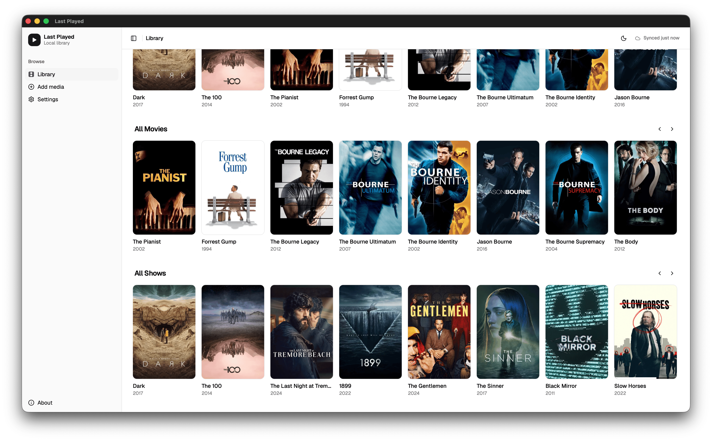

# Last Played

Track and resume your local movie and TV library.

Last Played is a Tauri 2 desktop app (React + TypeScript frontend, Rust backend). Point it at local video files, pull metadata and artwork from TMDB, play anything through an embedded libVLC, and keep watch progress in sync across devices with Turso.

## Screenshots



Library in dark mode with search, type and watch-state filters, Continue Watching, and Recently Added rows.



Add media via TMDB search with poster grid, type, year, and rating before import.



Add media preview panel with synopsis, season breakdown, and Add to library confirm.



Series detail with hero, resume point, season selector, and per-episode Play state plus linked local files.



Series-folder scan with high-confidence matches ready to link and non-video files listed as ignored.



Native playback with seek bar, audio and subtitle track pickers, playback rate, volume, and fullscreen controls.



Player episode drawer for switching episodes across seasons without leaving playback.



Keyboard shortcuts cheat sheet for playback, episodes, tracks, and window controls.



Library in light mode with All Movies and All Shows rows and sidebar navigation.

## Features

- Library with search, type filter (all / movie / TV), watch-state filter, and sort (recent / title), plus Continue Watching
- Add media via TMDB search with preview (seasons, episodes, artwork) before import
- Media detail with hero, seasons, episodes, resume point, ratings, and metadata refresh
- File linking per movie or episode, plus series-folder scan with auto-match, confirm, unmatched, and ignored states
- Native playback: play/pause, seek, volume, rate, audio/subtitle tracks, fullscreen, keyboard shortcuts, next-episode prompt, playlist across seasons
- Watch progress saved every 5s and on pause/end/unmount, with configurable watched threshold (default 90 percent)
- Missing-file detection with relink prompt, corrupt-file error state with retry
- Optional Turso sync: offline-first local DB, last-write-wins for catalog and progress, device-local file paths, 30s background loop
- Theming (light/dark), sidebar shell, empty states, About and Settings pages

## Tech stack

- Frontend: React 19, TypeScript, Vite, Tailwind CSS 4, shadcn/ui (Radix), TanStack Query, Zustand, React Router 7, Lucide icons
- Backend: Tauri 2, Tokio, Turso (local SQLite-compatible + remote HTTP sync), Reqwest (TMDB), Walkdir (scanner), libloading + raw-window-handle (embedded libVLC)
- Packaging: bundled libVLC staged by `scripts/stage-vlc.mjs`, Tauri bundle resources

Architecture and data flows: [docs/ARCHITECTURE.md](docs/ARCHITECTURE.md). Packaging, signing, and LGPL notes: [docs/PACKAGING.md](docs/PACKAGING.md).

## Getting started

Prerequisites: Node 20+, Rust stable, TMDB API key. Optional: VLC install (for dev playback without staging), Turso database (for multi-device sync).

```sh
npm install
npm run tauri dev
```

Web-only frontend (no Rust commands, limited playback):

```sh
npm run dev
```

First run flow:

1. Open Setup, pick Local or Remote (Turso) database mode.
2. Add your TMDB API key in Settings.
3. Add media from TMDB, then link local files (single file or series-folder scan).
4. Play from the media page. Progress resumes automatically.

## Scripts

| Command | What it does |
|---|---|
| `npm run dev` | Vite frontend only |
| `npm run tauri dev` | Full Tauri desktop app in dev |
| `npm run build` | `tsc && vite build` |
| `npm run tauri build` | Production desktop bundle (stage VLC first) |
| `npm run stage:vlc` | Stage libVLC into `src-tauri/vlc/` (`--from <dir>`, `--target macos\|windows\|linux`) |
| `npm run lint` | ESLint |
| `npm run format` / `format:check` | Prettier write / check |
| `npm run test` / `test:watch` | Vitest run / watch |

## Project structure

```text
src/
  App.tsx                 Router, QueryClient, config gate
  features/               library, media, linking, player, setup, settings, sync, about
  components/app/         shell, poster card, media grid, empty state, theme toggle
  components/ui/          shadcn primitives (button, dialog, sidebar, slider, etc.)
  lib/api.ts              Tauri invoke bindings (single IPC boundary)
  lib/app-config.ts       Zustand config store with debounced save
  hooks/                  theme, mobile
src-tauri/src/
  lib.rs                  Tauri setup, AppState, command registration
  commands/               config, library, media, linking, scan, watch, player, sync, db
  db/repositories/        device, media_item, season, episode, video_file, watch_progress
  services/               tmdb, scanner, sync, remote, player (embed + ffi)
  config.rs state.rs      config file + runtime state
scripts/stage-vlc.mjs     libVLC staging per OS
docs/                     ARCHITECTURE.md, PACKAGING.md
```

## Configuration

Stored in Tauri `app_config_dir/config.json` (`0600` on Unix). Holds `deviceId`, `deviceName`, `dbMode` (`local` | `remote`), `tmdbApiKey`, `tursoUrl`, `tursoAuthToken`, and player prefs (watched threshold, subtitle/audio language, subtitle font size, subtitle font, volume). Library data lives in `app_data_dir/library.db`.

Remote sync notes:

- Same local file works offline. Remote mode only adds reconciliation via Turso HTTP API.
- `video_file` rows are device-local: only this device's links are pushed, other devices show those titles as unlinked.
- Deletes propagate via a `deleted_media` tombstone table: an offline delete succeeds locally and converges on reconnect, and every device must sync at least once to observe a removal. Tombstones are retained (no GC yet).
- TMDB key and Turso token stay in `config.json`, never in the DB.

## Recommended IDE setup

- [VS Code](https://code.visualstudio.com/) + [Tauri](https://marketplace.visualstudio.com/items?itemName=tauri-apps.tauri-vscode) + [rust-analyzer](https://marketplace.visualstudio.com/items?itemName=rust-lang.rust-analyzer)
