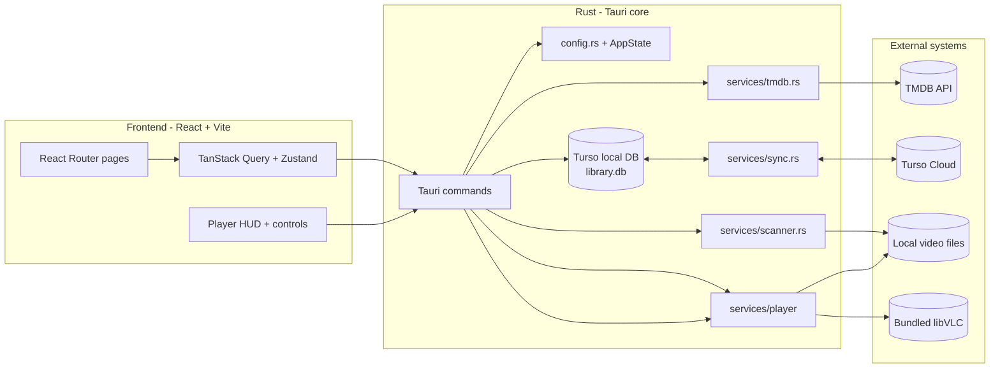
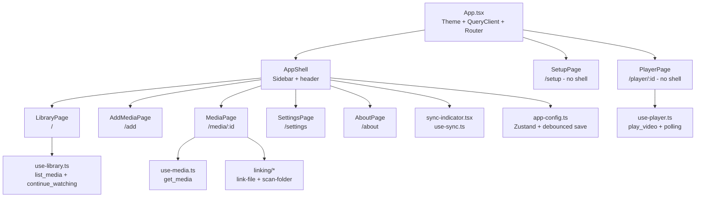
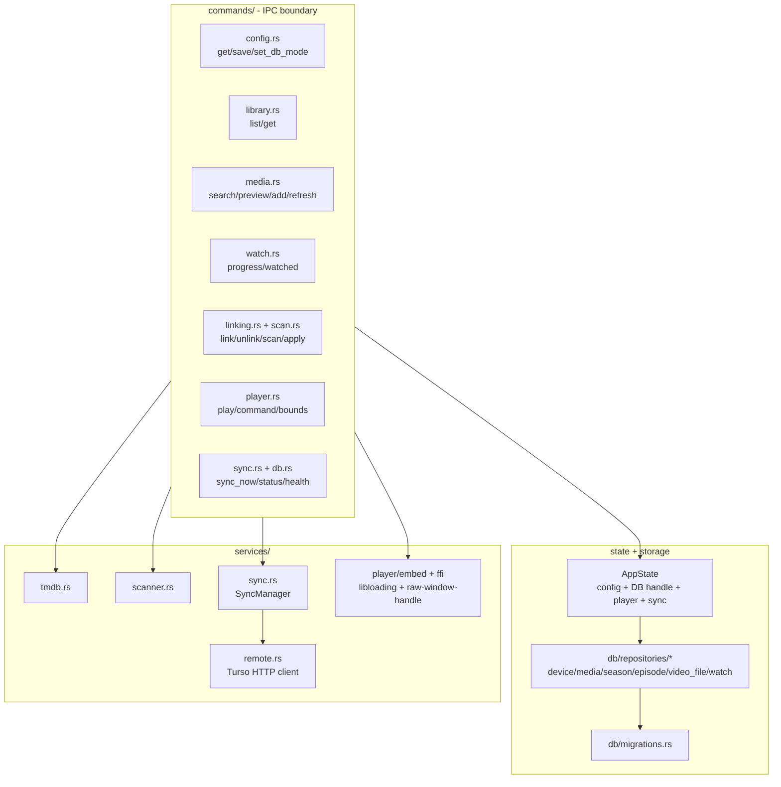
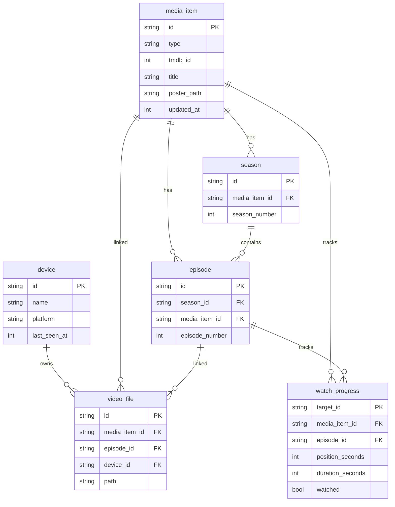
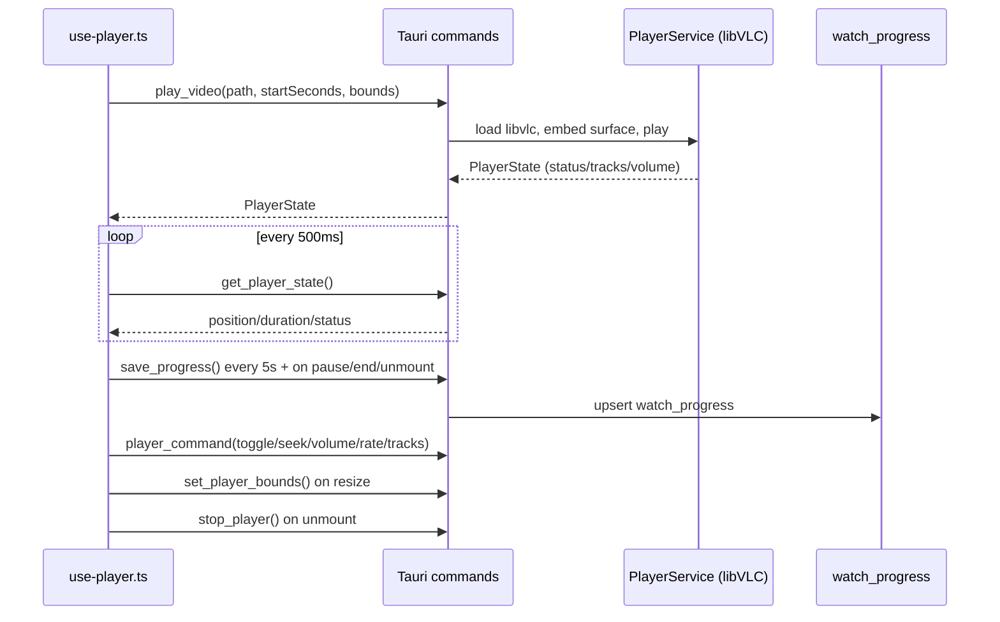
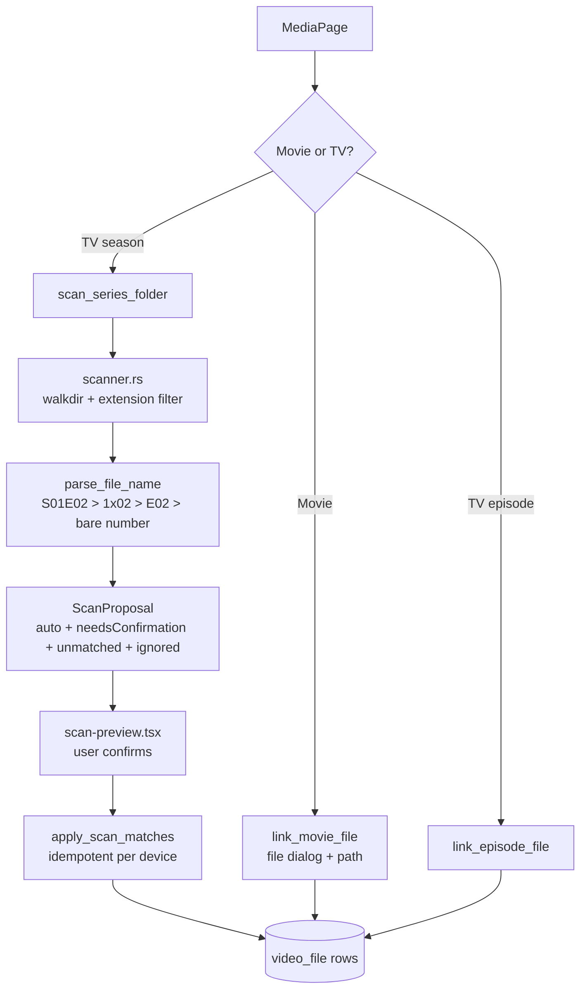

# Architecture

Last Played is a Tauri 2 desktop app for tracking and resuming a local movie and TV library. The frontend is React + TypeScript (Vite). The backend is Rust, exposed to the UI through Tauri commands. Video playback uses an embedded libVLC loaded at runtime. Metadata comes from TMDB. Sync across devices is optional via Turso.

Related docs:

- [README](../README.md)
- [Packaging and hardening](PACKAGING.md)

## System overview



Runtime layout:

- `src/` - React app. Pages live in `src/features/*`, shared shell and UI in `src/components/*`, Tauri bindings in `src/lib/api.ts`, global config store in `src/lib/app-config.ts`.
- `src-tauri/src/` - Rust backend. `lib.rs` registers all commands and boots `AppState`. `commands/` is the IPC boundary. `db/repositories/` owns SQL. `services/` owns TMDB, scanner, sync, remote, and player logic.
- `src-tauri/vlc/` - staged at build time by `scripts/stage-vlc.mjs`. Shipped as bundle resources, never committed except `README.txt`. See [PACKAGING](PACKAGING.md).
- `config.json` + `library.db` - per-device files under Tauri `app_config_dir` / `app_data_dir`. Config holds TMDB key, Turso credentials, device id, and player prefs with `0600` permissions on Unix.

## Frontend architecture



Key patterns:

- All backend access goes through `src/lib/api.ts`, which is a thin wrapper around Tauri `invoke()`. No direct SQL or filesystem access from React.
- Server state uses TanStack Query (`staleTime 30s`, `retry 1`, no refetch on focus). Global client config uses Zustand with a 400 ms debounced `save_config`.
- Routing uses `createBrowserRouter`. `/setup` gates on `dbMode == null`. `/player/:id` is outside `AppShell` so video gets a chromeless stage.
- UI primitives are shadcn-style components in `src/components/ui/*` plus app widgets in `src/components/app/*` (shell, poster card, media grid, empty state, theme toggle).

## Backend architecture



`AppState` (`state.rs`) holds:

- `config.json` path + in-memory `AppConfig` (Mutex)
- lazy `Database` handle (async Mutex, reset on mode switch)
- `PlayerService` + `NativeSurface` (Mutex)
- `SyncManager` (atomic dirty/running flags + runtime status)

`database()` opens local Turso always, then adds a `RemoteClient` only in remote mode. This keeps offline-first behavior identical in both modes.

## Data model

Tables (see `db/repositories/*` and `services/sync.rs`):



Notes:

- `video_file.path` is an opaque device-local string, always scoped by `device_id`. Sync pushes only this device's rows and never pulls other devices' paths.
- `watch_progress.target_id` is the media id for movies and the episode id for TV. `watched` flips when position passes `watchedThreshold` (default 90 percent).
- Sync tables use last-write-wins on `updated_at` (`media_item`, `watch_progress`). Catalog tables (`season`, `episode`, `device`) are insert-if-missing.

## Player flow



Details:

- `PlayerService` resolves libVLC in order: bundled `vlc/` resources, `LAST_PLAYED_VLC_DIR`, `VLC_PLUGIN_PATH`, then OS system locations. Dev builds without staged VLC fall back to system VLC.
- The video surface is a native window embedded under the webview (`raw-window-handle`, `objc2` on macOS). React reports DOM bounds so Rust can reposition it; `ResizeObserver` + window resize keep it aligned.
- Corrupt or unsupported files surface as `STATE_ERROR` -> `status: error` -> "could not be played" UI with retry.
- Playlist logic (`player-mock.ts` + `use-player.ts`) picks start index from saved progress, skips unlinked episodes, and supports next/previous/season jump. Progress is invalidated on `["media"]` query keys after unmount.

## Linking and scan flow



Rules:

- Samples and non-video extensions are ignored with reasons. Multi-episode files link to the first episode with a note.
- `apply_scan_matches` rejects two files for one episode and two episodes for one file. Re-applying replaces this device's links for the target episode only.
- Missing files are detected on read (`VideoFile.missing`) and shown with a relink prompt instead of failing silently.

## Sync flow

```mermaid
sequenceDiagram
    participant Writer as Any write command
    participant Mgr as SyncManager
    participant Loop as background_loop 30s
    participant Remote as Turso Cloud HTTP

    Writer->>Mgr: mark_dirty() + trigger_sync()
    Mgr->>Remote: reconcile tables LWW
    Mgr->>Remote: push this device video_file only
    Loop->>Mgr: tick every 30s if dbMode == remote
    Mgr->>Remote: apply_remote_schema + reconcile
    Remote-->>Mgr: finish_ok(last_synced_at) or finish_err(error)
```

- Both modes use the same local file. Remote mode adds reconciliation through `RemoteClient` (Turso HTTP API).
- Schema drift is handled by copying `sqlite_master` DDL to remote with `IF NOT EXISTS`, then `ALTER TABLE ADD COLUMN` for missing columns.
- Overlapping runs are coalesced: `begin()` CAS guard, `dirty` flag retained so the next tick retries.

## Config and startup

```mermaid
flowchart LR
    Boot[Tauri setup] --> CfgLoad[AppConfig::load<br/>generate UUID + hostname if new]
    CfgLoad --> State[AppState::new<br/>config + db + resource paths]
    State --> SyncLoop[spawn sync::background_loop]
    UIBoot[App.tsx load()] --> GetCfg[get_config]
    GetCfg --> Gate{dbMode set?}
    Gate -->|No| SetupPage[/setup]
    Gate -->|Yes| AppShell[/ + /add + /media + /settings]
```

- First run generates `device_id` (UUID v4) and `device_name` (hostname). `get_config` hydrates Zustand; `refreshHealth` checks schema version.
- `set_db_mode` closes the cached DB handle so the next access reopens with the correct local/remote path.

## Build and packaging

- `npm run dev` - Vite only. `npm run tauri dev` - full desktop shell.
- `npm run stage:vlc` (`scripts/stage-vlc.mjs`) copies `libvlc` + `plugins` into `src-tauri/vlc/` per OS before `npm run tauri build`. `tauri.conf.json` bundles `vlc/**/*` as resources.
- Icons, product name (`Last Played`), identifier (`com.hadi.last-played`), and category live in `tauri.conf.json`.
- Full signing, notarization, LGPL, and manual QA checklist: [PACKAGING](PACKAGING.md).
